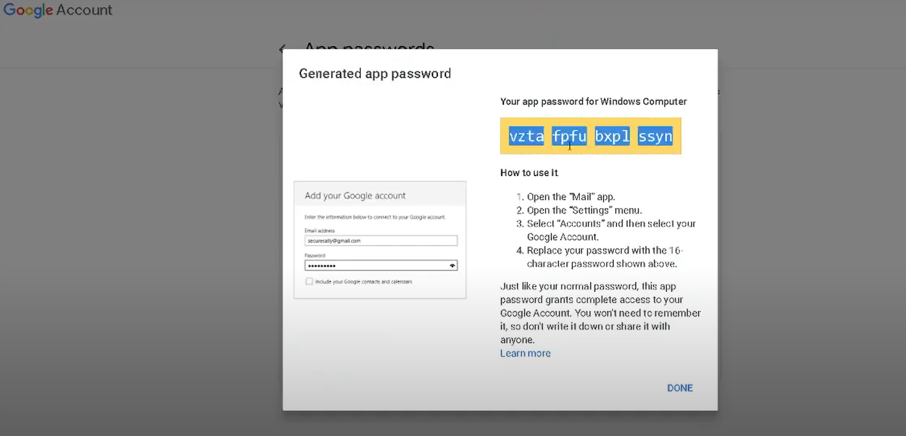

# Send-mail-using-Python

This is my code in place 2021 final project.
In this project,I had written a  program/script that can  send emails in Python using smtplib.In this project ,I had only sent/attach plain texts and pdf file.
But you can also send/attach images-jpg,...( simply connect to a gmail smtp server, login with our email credentials and  send an email to the gmail you want to 
send/attach -plain texts,images and pdf file)

# Steps

* Enter your Gmail Id :example123@gmail.com
* Enter your specific app password: vztafptubxplssyn *[note: Here put your generated password]*

 
*Screenshot of Generated app password.*

* Enter Gmail Id you want to send: example@gmail.com
* Enter your mail subject : Internship
* Enter your mail message : I am	pleased	to confirm your	acceptance of an internship as	web developer with XYZ company . Please see attached pdf for more detail.

* Enter filname of pdf file.
For example: note.pdf,kewang_cv.pdf,document.pdf
- >>>Filename:document.pdf

* Filename:hello.pdf

 - {}
* Sucessfully email send

# Youtube Video

Link : https://www.youtube.com/watch?v=vYzXRrat9aE

# Code in Place 2021 | Project Showcase:

- Serial number:1102
Link: https://codeinplace.stanford.edu/2021/showcase#:~:text=Code%20in%20Place%202021%20%7C%20Project,fundamentals%20of%20programming%20in%20Python.

